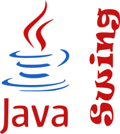

<!-- Sudipta Kumar Das -->

<!-- Green Line -->
  <!-- Work Experience -->

<!-- 

<b style="font-size:22px;">Levant IT Solution</b> Dhaka

 -->

- Develop website frontends by Vue.js
- Develop website backends by Java SpringBoot
- Database Used : PostGreSQL
- Worked with team Traktee

<!-- Green Line -->
  <!-- Skills --> 

   <h2> <b>Languages :</b></h2>  
    <!-- C# -->
    
    <!-- JAVA -->
    
    <!-- C++ -->
    
    <!-- C -->
    
    <!-- Python -->
    
    <!-- Kotlin -->
    
    <!-- LaTex -->
    
    <!-- MarkDown -->
     
    <!-- Bash -->
     

    <h2><b>Frontend :</b></h2>
        <h4><b>Framework :</b></h4>
            <!-- Swing -->
            
            <!-- Gradle -->
            
            <!-- Xamarin -->
            
            <!-- Next.js -->
            
            <!-- Node.js -->
             
            <!-- VUE.js -->
            
        <h4><b>Libraries :</b></h4>
            <!-- Bootstrap -->
            
            <!-- Tailwind -->
            
            <!-- Chart.js -->
            
        <h4><b>Others :</b></h4>
            <!-- HTML5 -->
            
            <!-- CSS -->
            
            <!-- Javascript -->
             
            <!-- Typescript -->
             
    

    <h2><b>Backend :</b></h2> 
        <h4><b>Framework : </b></h4>
            <!-- .NET -->
             
            <!-- Java SpringBoot -->
             
            <!-- Nest.js -->
             
            <h4><b>Others : </b></h4>
            <!-- PHP -->
            

    <h2><b>Database:</b></h2>  
    <!-- MySQL -->
     
    <!-- Oracle -->
    
    <!-- PostGreSQL -->
     

    <h2><b>UI/UX :</b></h2>  
    <!-- Canva -->
    
    <!-- AdobeXD -->
    
    <!-- Pencil -->
    <!-- Figma -->
    
    <!-- Blender -->
     

    <h2><b>UML Design :</b></h2>  
    <!-- Visual-Paradigm -->
    
    <!-- Dia  -->
    

    <h2><b>IDEs:</b></h2>  
    <!-- NetBeans -->
    
    <!-- Intellij-IDEA -->
    
    <!-- Visual-Studio -->
    
    <!-- Visual-Studio-Code -->
    
    <!-- Android-Studio -->
    
    <!-- Pycharm -->
    
    <!-- CodeBlocks -->
    
    <!-- Arduino -->
     

    <h2><b>Machine Learning</b></h2> 
         
        <h4>Libraries</h4>
            <!-- Seaborn -->
             
            <!-- Pandas -->
             
            <!-- Scikit Learn -->
             

    <h2><b>Others:</b></h2>  
    <!-- Git -->
    
    <!-- Adobe-Illustrator -->
     
    <!-- PhotoShop -->
     
    <!-- Unity -->
    
    <!-- Postman -->
    
    <!-- Linux -->
    

 

<!-- AIUB -->

**Bachelor of Computer Science & Engineering,** Dhaka, Bangladesh

<!-- DIC -->

**Higher Secondary School Certificate,** Dhaka, Bangladesh

<!-- School -->

**Secondary School Certificate,** Dhaka, Bangladesh

<!-- Green Line -->
 

<a href="https://www.gmail.com" target="blank"> engineer.sudipta.kumar.das@gmail.com</a> 
 
<a href="" target="blank">     +8801931117419</a>  
<a href="https://sudiptakumar.com/" target="blank">sudiptakumar.com//</a> 
 

<!-- Contact With Me -->

    <!-- Facebook -->
     
    <!-- Instagram -->
     
    <!-- Linkedin -->
     
    <!-- Discord -->
     
    <!-- Stack Overflow -->
     
    <!-- YouTube -->
     
    <!-- Kaggle -->
    

<!-- Profile Viewers -->

  

<!-- Spotify Last Played -->

<h2>Spotify Playing 🎧</h2>  

       
        

            <!--                                                                Most Used Language -->
          
        

        

            <!--                                                                GitHub Stats -->
            <a href="https://github.com/the-sudipta">
            
            <!--                                                                GitHub Current Streak -->
            
            </a>
       

       

            <!--                                                                   Coding Activity Graph -->
            
            <!--                                                                    Language Graph -->
            
            <!--                                                                    Editor Graph -->
            
       

       
 
            <!-- Github Trophies -->
            <h4><b>GITHUB TROPHIES</b></h4>
             
       

<h2><b>Support me </b></h2>

<!-- Discord Theme = 212121 -->

<!-- Add Images in Markdown -->
<!--  -->
<!--  -->
<!--  -->

[//]: # (<!-- Twitter Follower Counter Badge -->)

[//]: # (
  
)

[//]: # (<!-- Twitter -->)

[//]: # ( )
