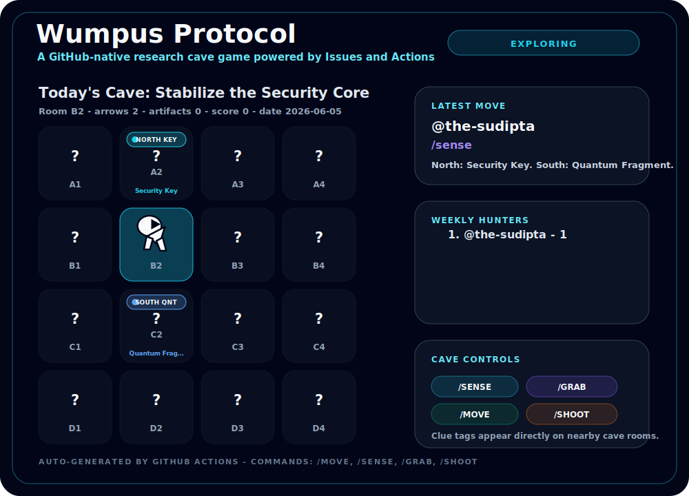
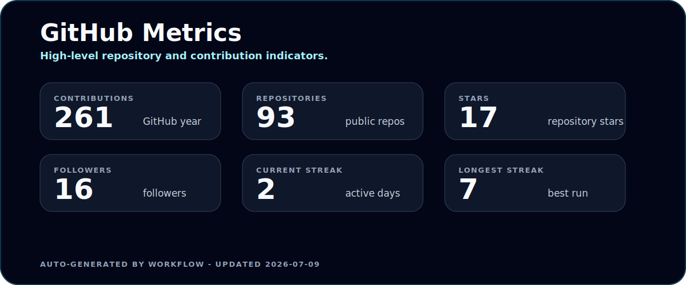
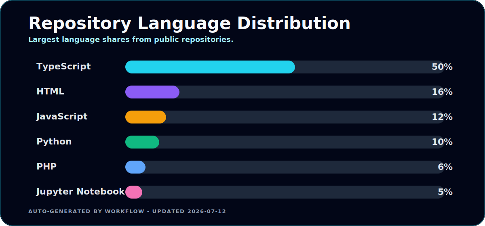
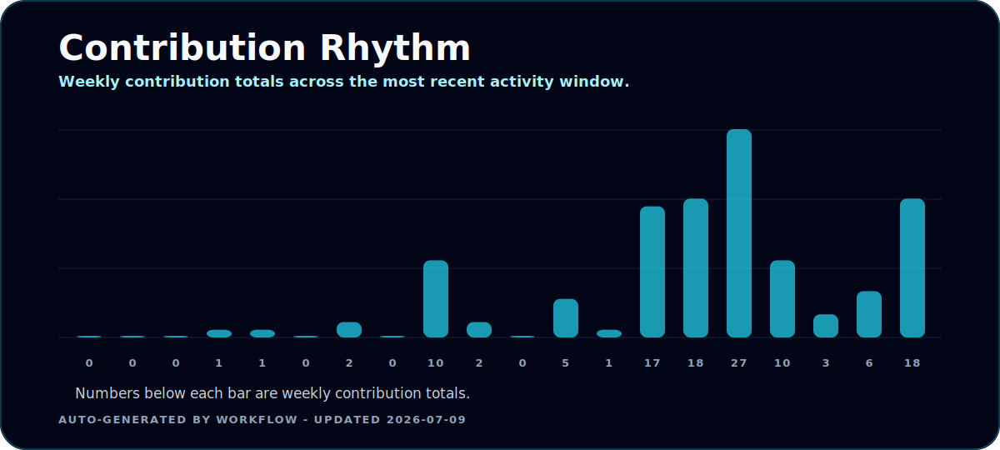
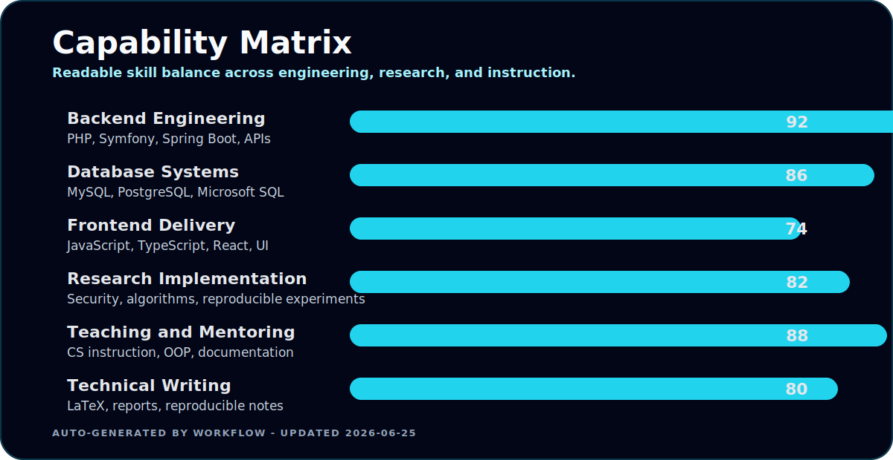
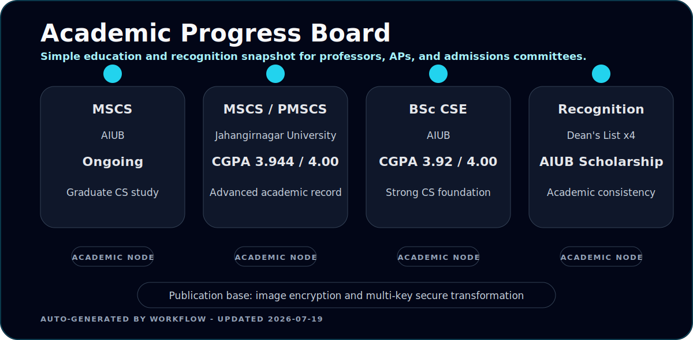
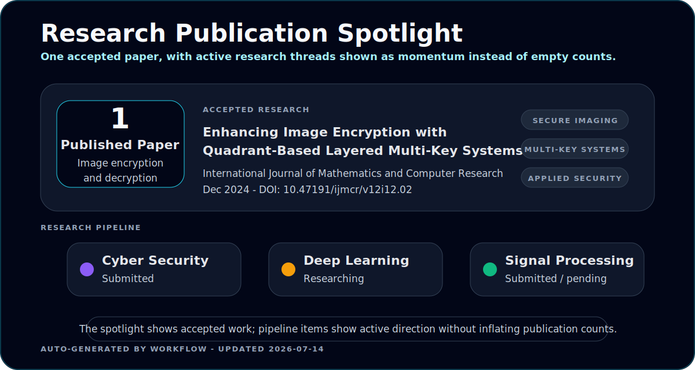
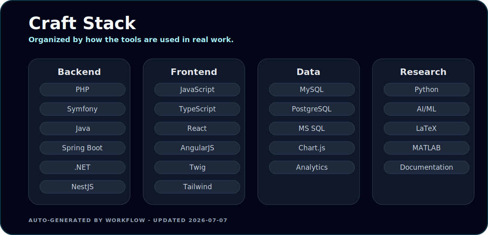

  
  
  
  
  

  
  
  
  

 

  

## Hello, I am Sudipta

I am a computer science instructor from Bangladesh and a software engineer, shaped by three quiet obsessions: building reliable software, explaining hard ideas simply, and asking research questions that can become useful systems.

My GitHub is not meant to be a PDF in disguise. It is the public lab notebook of someone who wants to grow into a rare kind of engineer: practical enough for production, rigorous enough for research, and patient enough to teach.

<table>
  <tr>
    <td width="33%" align="center">
      <h3>Educator</h3>
      
CS instructor, mentor, and technical communicator who enjoys making complex architecture feel understandable.

    </td>
    <td width="33%" align="center">
      <h3>Researcher</h3>
      
Image encryption, blockchain research, algorithms, bioinformatics, quantum computing, and computational chemistry.

    </td>
    <td width="33%" align="center">
      <h3>Builder</h3>
      
Tool builder, Full-stack systems, backend services, database-backed products, analytics, and clean implementation habits.

    </td>
  </tr>
</table>

## Current Coordinates

<table>
  <tr>
    <td width="50%" valign="top">
      <h3>Now</h3>
      

        Instructor, CS at <b>American International University-Bangladesh</b>, while continuing graduate study and research-facing engineering work.
      

      

        I am especially interested in teams and labs where software is not just code, but a vehicle for trust, security, scientific discovery, and measurable impact.
      

    </td>
    <td width="50%" valign="top">
      <h3>Looking For</h3>
      

        Lecturer roles or Software engineering roles, backend (PHP) opportunities, research assistantship conversations, and funded PhD opportunities in computer science.
      

      

        Best fit: supervisors and teams who value curiosity, discipline, documentation, research taste, and the ability to turn abstract ideas into working systems.
      

    </td>
  </tr>
</table>

## Wumpus Protocol

  

## Live Metrics

  
  
  

  

  

  

  

<!-- 

  

 -->

  

## Research Signal

  
  
  
  
  

<table>
  <tr>
    <td width="70%" valign="top">
      <h3>Enhancing Image Encryption with Quadrant-Based Layered Multi-Key Systems</h3>
      

        A published research thread focused on secure image transformation and layered multi-key encryption design.
        This is the kind of work I want to deepen: security-aware, mathematically thoughtful, and implementation-friendly.
      

      

        <b>Authors:</b> Abu Juha Ahmed Muid, Sudipta Kumar Das, MD Sydur Rahman, Dr. Md. Mahbubur Rahman 
        <b>Venue:</b> International Journal of Mathematics and Computer Research, Dec 2024
      

    </td>
    <td width="30%" align="center" valign="middle">
      
        
      
        
      
    </td>
  </tr>
</table>

## Craft Stack

  

## Academic Thread

<table>
  <tr>
    <td width="25%" align="center">
      <h3>AIUB</h3>
      
<b>MSCS</b> Ongoing

    </td>
    <td width="25%" align="center">
      <h3>Jahangirnagar University</h3>
      
<b>MSCS under PMSCS</b> Approx. CGPA 3.944/4.00

    </td>
    <td width="25%" align="center">
      <h3>AIUB</h3>
      
<b>BSc CSE</b> CGPA 3.92/4.00

    </td>
    <td width="25%" align="center">
      <h3>Recognition</h3>
      
<b>Dean's List x4</b> AIUB academic scholarship

    </td>
  </tr>
</table>

## Job Thread

<table>
  <tr>
    <td width="25%" align="center">
      <h3>AIUB</h3>
      
<b>Instructor, CS</b> Oct 2025 - Present

    </td>
    <td width="25%" align="center">
      <h3>Softvence IT Limited</h3>
      
<b>Trainee Backend Developer</b> Oct 2025 Betopia Group

    </td>
    <td width="25%" align="center">
      <h3>Itransition</h3>
      
<b>Commercial Software Development</b> PHP Training May 2025 - July 2025

    </td>
    <td width="25%" align="center">
      <h3>EnKaizen</h3>
      
<b>Java Spring Boot</b> Sept 1, 2023 - Nov 30, 2023

    </td>
  </tr>
</table>

## What Makes Me Useful

<table>
  <tr>
    <td width="50%" valign="top">
      <h3>For employers</h3>
      

        I teach undergraduate students different courses (e.g., C++, Data Structure etc.) bring backend discipline, database thinking, frontend awareness, documentation habits, and the ability to learn a codebase without making unnecessary noise.
      

      

        I am most excited by teams building real products where correctness, maintainability, and user trust matter.
      

    </td>
    <td width="50%" valign="top">
      <h3>For professors and APs</h3>
      

        I bring implementation ability, teaching experience, research curiosity, and the patience to refine an idea until it becomes experimentally useful.
      

      

        I am especially drawn to labs working around blockchain, algorithms, bioinformatics, quantum computing, computational chemistry, secure systems, and image processing.
      

    </td>
  </tr>
</table>

## Formal Details

The profile above is the story. The CV is the structured document.

## Connect

  

